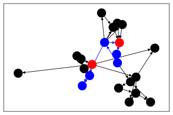

Basic Usage
===========

GraphLog can be used as a regular Python module to access the datasets
used in the paper `“Evaluating Logical Generalization in Graph Neural
Networks” <#archive>`__. Additionally, GraphLog also provides necessary
`Dataset <https://pytorch.org/docs/stable/data.html?highlight=dataset#torch.utils.data.Dataset>`__
and
`DataLoader <https://pytorch.org/docs/stable/data.html?highlight=dataloader#torch.utils.data.DataLoader>`__
packages for easy training and evaluation.

Loading the data
~~~~~~~~~~~~~~~~

When GraphLog is imported for the first time, it downloads the data and
creates a ``./data`` directory in the current working directory. The
downloaded data is then unzipped and placed within this directory.

.. code:: ipython3

    from graphlog import GraphLog
    gl = GraphLog()

To change the data directory, pass the ``data_dir`` argument.

.. code:: ipython3

    gl = GraphLog(data_dir='/tmp/data')

Viewing the data
~~~~~~~~~~~~~~~~

GraphLog consists of multiple ``datasets``. Each dataset is built using
its own set of **rules**, which themselves are procedurally generated
and sampled from a large knowledge-base.

To view all possible datasets in GraphLog:

.. code:: ipython3

    gl.get_dataset_names_by_split()

This will provide a list of dataset ids in train, valid and test splits.
To load a single dataset, use the ``get_dataset_by_name`` method:

.. code:: ipython3

    rule_3 = gl.get_dataset_by_name('rule_3')
    type(rule_3)

    >> graphlog.dataset.GraphLogDataset

This will load a ``GraphLogDataset`` object, which is in-turn a Pytorch
``Dataset`` instance. Each dataset also has its own training, validation
and test splits.

The ``GraphLogDataset`` object essentially contains `Pytorch
Geometric <https://github.com/rusty1s/pytorch_geometric>`__ graphs, a
query tuple of ``<source, sink>`` nodes for each datapoint, and a label
or relation to predict.

You can also view the aggregate statistics of the dataset:

.. code:: ipython3

    gl.compute_stats_by_dataset("rule_3")

    >> Data Split : train, 
    Number of Classes : 16, 
    Number of Descriptors : 189, 
    Average Resolution Length : 3.632142857142857, 
    Average number of nodes : 11.137  and edges : 13.273

.. parsed-literal::

    {'num_class': 16,
     'num_des': 189,
     'avg_resolution_length': 3.632142857142857,
     'num_nodes': 11.137,
     'num_edges': 13.273,
     'split': 'train'}

You can also convert the dataset into
`networkx <https://networkx.github.io/>`__ format, in order to perform
quick calculations or visualization:

.. code:: ipython3

    import networkx as nx
    from graphlog.utils import load_networkx_graphs
    nx_graphs, nx_queries = load_networkx_graphs(rule_3.json_graphs["train"])

.. code:: ipython3

    nx.info(nx_graphs[0])

To view a single graph in the dataset, you can also use the inbuilt
``display_single_graph`` api.

.. code:: ipython3

    gl.display_single_graph(rule_3, "train",21)

Extracting dataloaders
~~~~~~~~~~~~~~~~~~~~~~

We provide a method to generate dataloaders for each dataset as follows:

.. code:: ipython3

    rule_3_train = gl.get_dataloader_by_mode(rule_3, mode="train")
    rule_3_valid = gl.get_dataloader_by_mode(rule_3, mode="valid")
    rule_3_test = gl.get_dataloader_by_mode(rule_3, mode="test")

Supervised Training
~~~~~~~~~~~~~~~~~~~

A very minimal dummy training script is provided below to show how easy
it is to train your models.

.. code:: ipython3

    for batch_idx, batch in enumerate(rule_3_train):
        graphs = batch.graphs
        queries = batch.queries
        targets = batch.targets
        world_graphs = batch.world_graphs
        logits = your_model(graphs, queries, world_graphs)

